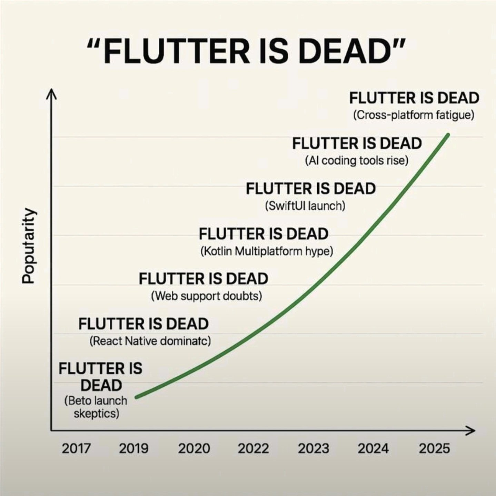
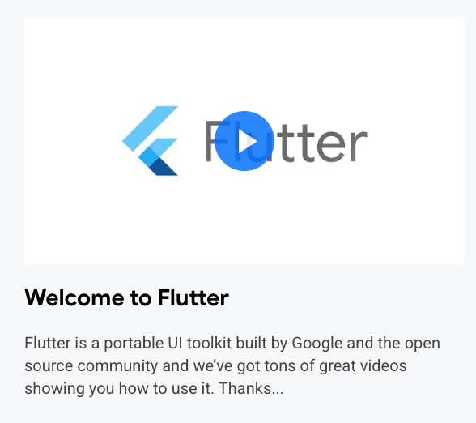

# Flutter is NOT DEAD.

### Kurogoma4D

@ FlutterKaigi 2025

  <a href="https://github.com/Kurogoma4D" target="_blank" alt="GitHub"
    class="text-xl slidev-icon-btn opacity-50 !border-none !hover:text-white">
    <carbon-logo-github />
  </a>

---
transition: fade-out
---

# $ whoami

  
  

    株式会社Sun Asterisk - Lead Native-app Engineer X: @Krgm4D
  

- 使ったことあるクロスプラットフォーム技術
  - Flutter, React Native(Expo), Xamarin Forms, ちょっとKMP, ちょっと.NET MAUI
- Jetpack ComposeやSwiftUIも好き
  - 宣言的UIの流れを作ったReact、Flutterに感謝
- 自作キーボード勢

---
transition: none
---

# 皆さんに質問です

  

    🙋 普段Flutterで開発していますか？
  

---
transition: none
---

# 皆さんに質問です

  

    🙋 普段Flutterで開発していますか？
  

  

    🙋 ネイティブアプリ・ガワアプリをFlutterにリプレイスしたことはありますか？
  

---

# 皆さんに質問です

  

    🙋 普段Flutterで開発していますか？
  

  

    🙋 ネイティブアプリ・ガワアプリをFlutterにリプレイスしたことはありますか？
  

  

    🙋 逆にFlutterアプリをネイティブアプリ・その他フレームワークにリプレイスした方は？
  

---
transition: fade-out
layout: center
---

# 今日は技術選定の話をします

特に「Flutterの採用が視野に入っているとき」に
考えるべきことについて

---

# 昨今のFlutterを取り巻く声

  
  
https://x.com/vibetushar/status/1939762052173897744

---
layout: center
---

# Flutterに対する2つの大きな不安

  

    
1

    
アーキテクチャ上の特徴

  

  

    
2

    
メンテナー問題

  

---
layout: center
---

# 不安その1

## アーキテクチャ上の特徴

---

# Flutterのアーキテクチャ上の特徴

  

    FlutterはネイティブのUI要素を描画しない
  

  

    
    https://docs.flutter.dev/resources/architectural-overview
  

---

# Flutterのアーキテクチャ上の特徴

  

    FlutterはネイティブのUI要素を描画しない
  

  

    つまり、プラットフォーム上のUIの変化についていけない
  

  

    
例えば

    

      
• iOSの新しいLiquid Glassデザイン

      
• AndroidのMaterial Designの進化

      
• その他新しいシステムコンポーネント

    

  

---

# でも、ちょっと待って

  

    プラットフォームのUIの変化は誰もが望むものだろうか？
  

  

    • アプリ開発者や一部のユーザーにとっては嬉しいかもしれない 
    • 最新のプラットフォーム事情に追従できることは魅力的
  

---

# 見方を変えてみる

  Flutterは単なる 
  「iOS/Androidをターゲットにしたクロスプラットフォームフレームワーク」 
  ではない

---

# Flutterを

  プラットフォームへの統合が容易な UIツールキット 
    として見たらどうか？
  

---

# これは公式サイトにも書かれている

  
  
https://flutter.dev/learn

---

# Flutterを採用したとき

  

    OSの世界観をそのまま引き継がずにプロダクト独自のUIを構築することは 
    ほぼ既定路線である
  

  

    
これは嬉しくない組織もあるが
      逆に嬉しい組織もあるのでは？
    

  

  

    
例えば

    あるWebサービス上で独自の世界観を築き上げている中で、 
    モバイルアプリを新規開発したいパターンなど
  

---

# プラットフォームUIの採用について

  
ネイティブでの実装にしろ、React Native他フレームワークを使うにしろ

  

    AndroidでMaterial、 
    iOSでLiquid Glassを採用しない以上は 
    UIに対する姿勢はどれも変わらない
  

  

    プラットフォームの世界観を重視するなら、
    SwiftUIやJetpack Composeを選んだほうが 
    幸せになれるかもしれない
  

---

# つまり

  

    アーキテクチャの点で不安になるということは 
    現在の開発チームと技術が ハマっていない 
    ということ
  

  

    
重要なのは

    

      • OSの世界観を大事にしたいのか？ 
      • プロダクト独自の世界観を構築したいのか？ 
      • 複数プラットフォームで一貫したUIを提供したいのか？
    

  

---
layout: center
---

# 不安その2

## メンテナー問題

---

# メンテナー問題とは

  

    Flutterリポジトリには大量のissueがある
  

  

    • issueやPRを上げてもなかなか進まないという話はどうしても挙がる 
    • メンテナーが不足している？ 
    • 本当に継続的にメンテナンスされているのか？
  

  

    これに関しては難しい問題
  

---

# 実際のところ

  

    

      
• 優先度付けはされている

      
• そのレポートもある

      
• <a href="https://github.com/flutter/flutter/wiki/2025-Issue-Triage-Reports">https://github.com/flutter/flutter/wiki/2025-Issue-Triage-Reports</a>

      
• 対応される速度に差はある

    

  

  

    すべてのissueが同じ速度で対応されるわけではない 
    これはどのOSSプロジェクトでも同じ
  

---

# 我々にできること

  

    コントリビュートすればいい
  

  

      この辺はkojiさんのセッション「Flutterコントリビューションのススメ」でもモチベーションや方法論について言及している 
  

  

    issueやフォーラムでの議論も大事だが、 
    実際にPRを提示するのも同じくらい大事
  

---

# Flutterのテストカバレッジ

  

    特にFlutter本体はテストコードが充実している
  

  

    
• ユニットテスト

    
• 統合テスト

    
• E2Eテスト

  

  

    振る舞い的な正しさはテストでかなり担保できる
  

---
transition: fade-out
---

# 自分たちでコントロールできる

  

    もしもFlutterに不具合があれば 
    自分たちのコントロールできる範疇で対応可能
  

  

    今のところ 
    解消されていない不具合で致命的にアプリ開発ができないみたいなものは無い（個人の感想）
  

  

    仮にそのようなものがあるとしたとき 
    どちらかと言うと 
    アーキテクチャ上やりたいことと噛み合っていない可能性がある
  

---
layout: center
---

# Q. Flutterはどんなプロジェクトに向いてる？

---

# A. UIを自由自在に設計したいとき

  

    

      
Flutter

      
UIツール キット

      
自由なUI設計

    

  

  
+

  

    

      
Dart

      
ロジック 記述

      
同じ言語で実装

    

  

  
=

  

    
気楽にアプリ開発

    
UI + ロジックを一貫して構築できる

  

---

# A. 組んだアプリを別のプラットフォームで展開したいとき

  

    

      • KMPやフルネイティブと比較すると明確な強み  
      • React Nativeに関しては同じような構造なので同様のメリットを得られる  
    

  

---
transition: fade-out
layout: center
---

# 結論

---
transition: fade-out
---

# Flutter is NOT DEAD.

  

    Flutterは別にまだ死んではいない
  

  

    

      「このプロジェクトでやりたいことがある」 
      ↓ 
      「だからこの技術を採用する」
    

  

  

    

      更にFlutterに対して、コミュニティでやれることもまだまだある
    

  

---
transition: fade-out
layout: center
---

# FAQ

---
transition: fade-out
---

# Q. LLM（AI）エージェントはTypeScriptのほうが優れてますよね？

  

    A. そうかもしれない
  

  

    しかし、エージェントが犯す
    TypeScriptの記述ミスとDartの記述ミスに、
    致命的な差はあるか？
  

---
transition: fade-out
---

# 結局やることは同じ

  

    エージェントがエラーを出したら
  

  

    
1. エージェントに追加のコンテキストを与えて修正してもらう

    
または

    
2. 自分の手で直す

  

  

    そう、導くのはあなた
  

---
transition: fade-out
layout: center
---

# Thank you Flutter team!

---
transition: fade-out
layout: center
---

  
  

    <a href="https://sun-asterisk.com/recruitment/mid-career/">https://sun-asterisk.com/recruitment/mid-career/</a>
  

