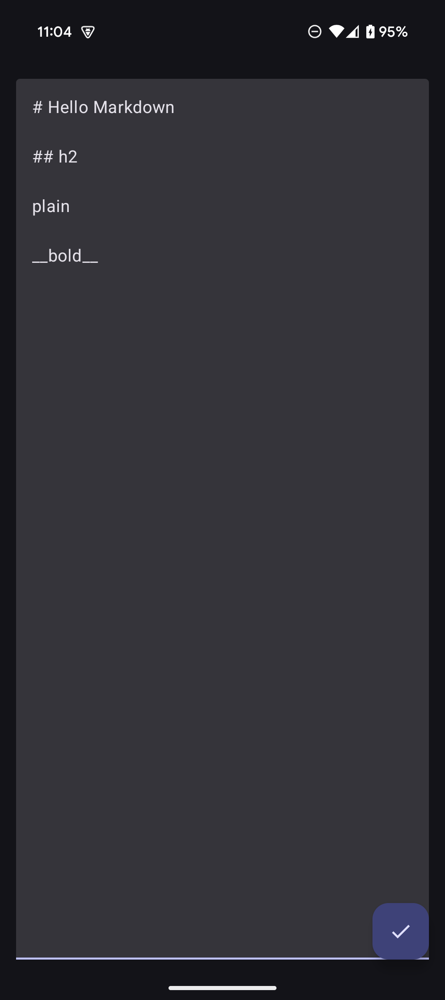
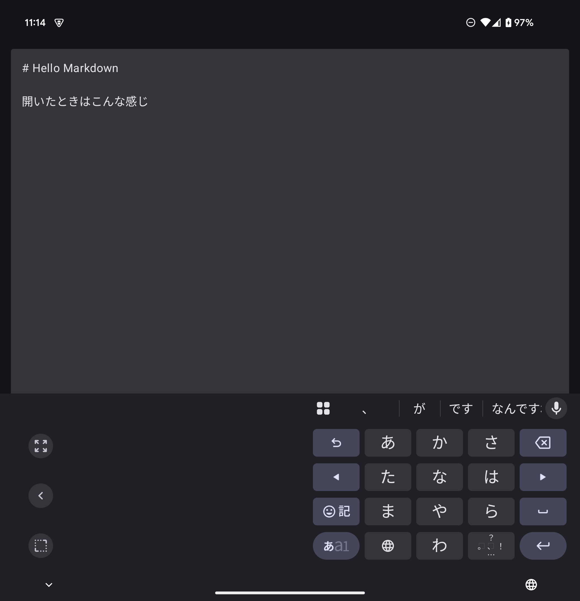
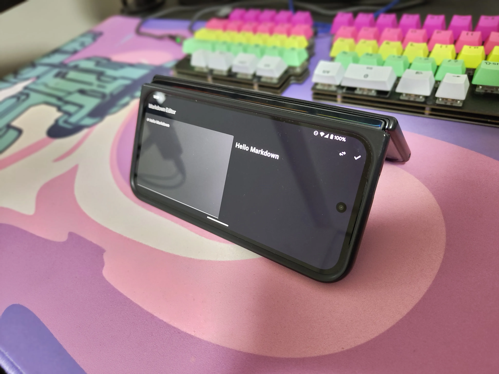
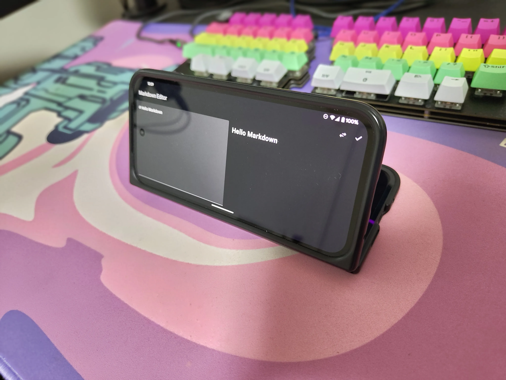

# Foldable端末で最強のメモ環境を作りたい

### Kurogoma4D

@ Sansan×DMM.com Android Tech Talk

<div class="flex items-center mt-12">
  
  <div class="ml-12">
    株式会社Sun Asterisk - Lead Native-app Engineer<br>X: @Krgm4D
  </div>
</div>

<div class="abs-br m-6 flex gap-2">
  <a href="https://github.com/Kurogoma4D" target="_blank" alt="GitHub"
    class="text-xl slidev-icon-btn opacity-50 !border-none !hover:text-white">
    <carbon-logo-github />
  </a>
</div>

---

# 伝えたいこと

- Foldable対応を考える時、まずはAdaptive Layoutの検討をしよう
- Foldable端末の画面状態を取得できるAPIがある
  - 必要なら活用しよう
  - （触れてないけど、半開きの状態か開いている状態か、とかも取得できる）
- 端末を開いた状態でサブディスプレイのみを使う事ができる
  - 両方の画面を使うこともできる
- 画面回転を考慮しよう

---
transition: fade-out
layout: center
---

# Android で最強のメモ環境を作りたい！

- 日々のメモを取るのにCosenseを使っている
- 昨今のAIブームのアオリを受けて、Cosenseからの脱却を図る

<!--
マークダウンエディタは技術者にとって使い勝手の良い記法です。
Cosenseは良いアプリですが、自分の理想とするエディタを作りたいと思います。
-->

---
transition: fade-out
---

# 今のメイン端末

<div class="flex flex-col items-center justify-center">
  <div class="text-center mb-4">
    <span class="text-2xl font-bold">Pixel 9 Pro Fold</span>
  </div>
  
  <div class="flex justify-center">
    
  </div>
  
  <div class="mt-8 text-xl">
    Foldable対応をちゃんとしたエディタを作ろう！
  </div>
</div>

<!--
Pixel 9 Pro Foldは折りたたみ式の大画面を活かせるアプリを作るのに最適なデバイスです。
-->

---
transition: fade-out
image: ./images/specs.png
layout: image-right
backgroundSize: contain
---

# やってみる

最初は仕様を.mdで書き出す

↓

コード生成

環境はVS Code Insiders + GitHub Copilot Agent

↓

ちょっと手直し

（最初プレビューがWebViewだったのでAnnotatedStringを使ってTextに置き換えるなどした）

<!--
基本的な機能を説明するスライドです。
-->

---
transition: fade-out
---

# ビルド結果

<div class="flex justify-center">
  <div class="flex-1">
    
  </div>
  <div class="flex-1">
    
  </div>
  <div class="flex-2 flex justify-center">
    
  </div>
</div>

---
transition: fade-out
layout: center
class: text-center
---

# Foldable対応

<div class="grid grid-cols-2 gap-12 mt-8">
  <div class="border-2 p-6 rounded-lg shadow-md">
    <div class="text-center font-bold text-xl mb-4">閉じた状態</div>
    <div class="bg-blue-100 p-4 rounded-lg text-gray-800">
      <div class="text-xl font-bold mb-2">1カラム構成</div>
      <div class="text-lg mt-4">スワイプでエディタ⇔プレビュー切替</div>
    </div>
  </div>
  
  <div class="border-2 p-6 rounded-lg shadow-md">
    <div class="text-center font-bold text-xl mb-4">開いた状態</div>
    <div class="bg-green-100 p-4 rounded-lg text-gray-800">
      <div class="text-xl font-bold mb-2">2カラム構成</div>
      <div class="text-lg">エディタとプレビューを並べて表示</div>
      <div class="text-lg mt-2">左右のカラムは入れ替え可能</div>
    </div>
  </div>
</div>

---

# どうすればいいか

```kotlin
val windowSizeClass = currentWindowAdaptiveInfo().windowSizeClass
val isOpened = windowSizeClass.isWidthAtLeastBreakpoint(WindowSizeClass.WIDTH_DP_MEDIUM_LOWER_BOUND)
```

https://developer.android.com/develop/ui/compose/layouts/adaptive?hl=ja

これを追加して、Composableを出し分ける

```kotlin
if (isOpened) {
    Row(...) {
        Column(modifier = Modifier.weight(1f)) {
            EditorScreen(viewModel.markdownText, viewModel::onMarkdownTextChange)
        }
        Column(modifier = Modifier.weight(1f)) {
            PreviewScreen(viewModel.parsedHtml)
        }
    }
} else {
    HorizontalPager(
        ...
    ) ...
}
```

---
layout: two-cols
---

# どうなるか


::right::

# &emsp;

Adaptive Layoutにより画面サイズが変わったらそれに応じて変化する

Foldable端末を想定した端末の状態を取得するAPIもある
https://developer.android.com/develop/ui/compose/layouts/adaptive/foldables/make-your-app-fold-aware

> The WindowInfoTracker interface in Jetpack WindowManager exposes window layout information. The interface's windowLayoutInfo() method returns a stream of WindowLayoutInfo data that informs your app about a foldable device's fold state. The WindowInfoTracker#getOrCreate() method creates an instance of WindowInfoTracker.

今回のような要件では、Adaptive Layoutのほうがタブレット等他の環境も考慮できていてベター

---

# Foldable特有の対応をしてみる

<div class="flex justify-content">
  <div class="w-100 justify-content flex-1 text-center">
    
    こうしたい時があるかもしれないし
  </div>
  <div class="w-100 justify-content flex-1 text-center">
    
    こうしたい時もあるかもしれない
  </div>
</div>

---

# 背面ディスプレイ対応（サブディスプレイモード）

開いた状態から背面ディスプレイにActivityを移動する（or 両画面を使う）API

<div class="flex justify-content items-center">
  
  <div class="ml-4">
    主にカメラアプリで背面セルフィーをするときに使われる
    この機能を使わないと、端末を開く/閉じる判定により勝手に画面が消えてしまう
  </div>
</div>

https://developer.android.com/develop/ui/compose/layouts/adaptive/foldables/support-foldable-display-modes

---

# 準備

```kotlin
  // サブディスプレイに切り替えるための起点となるController
  private lateinit var windowAreaController: WindowAreaController

  // サブディスプレイモード切り替え時に渡すexector
  private lateinit var displayExecutor: Executor

  // Foldable特有の機能が使用可能か、などの情報にアクセスするための `WindowAreaSession` を持つオブジェクト
  private var windowAreaInfo: WindowAreaInfo? = null

  // 後述のoperationが利用可能か、あるいは今どのような状態かを示す変数
  private var capabilityStatus: WindowAreaCapability.Status =
      WindowAreaCapability.Status.WINDOW_AREA_STATUS_UNSUPPORTED

  // サブディスプレイモードを表すoperation
  private val rearDisplayOperation = WindowAreaCapability.Operation.OPERATION_TRANSFER_ACTIVITY_TO_AREA
```

---

# 画面状態の取得・検知

```kotlin
    // onCreate内
    displayExecutor = ContextCompat.getMainExecutor(this)
    windowAreaController = WindowAreaController.getOrCreate()
    lifecycleScope.launch(Dispatchers.Main) {
        // 現在の画面の状態やサブディスプレイモードが利用可能かどうかを監視する
        lifecycle.repeatOnLifecycle(Lifecycle.State.STARTED) {
            windowAreaController.windowAreaInfos
                .map { info -> info.firstOrNull { it.type == WindowAreaInfo.Type.TYPE_REAR_FACING } }
                .onEach { info -> windowAreaInfo = info }
                .map { 
                  it?.getCapability(rearDisplayOperation)?.status
                    ?: WindowAreaCapability.Status.WINDOW_AREA_STATUS_UNSUPPORTED
                }
                .distinctUntilChanged()
                .collect {
                    capabilityStatus = it
                }
        }
    }
```

---

# サブディスプレイモードの起動

```kotlin
// サブディスプレイモードをアクティブにするボタンを押したときの処理
onTapSwitchDisplay = {
    when(capabilityStatus) {
        WindowAreaCapability.Status.WINDOW_AREA_STATUS_AVAILABLE -> {
            windowAreaInfo?.token?.let { token ->
                windowAreaController.transferActivityToWindowArea(
                    token = token,
                    activity = this,
                    executor = displayExecutor,
                    windowAreaSessionCallback = this
                )
            }
        }
        WindowAreaCapability.Status.WINDOW_AREA_STATUS_ACTIVE -> {
            val windowAreaSession = windowAreaInfo?.getActiveSession(rearDisplayOperation)
            windowAreaSession?.close()
        }
        else -> {
        }
    }
}
```

---
layout: center
---

# 結果

<video controls class="h-100" src="./images/rotation_reversed.mp4" type="video/mp4">
</video>

---

# 🤔

横向きにした時、画面が逆向きになっている

→ 一旦、画面回転したときに**描画を逆向きにしてみる**

```kotlin
  override fun onConfigurationChanged(newConfig: Configuration) {
      super.onConfigurationChanged(newConfig)
      val isLandscape = newConfig.orientation == Configuration.ORIENTATION_LANDSCAPE
      
      if (isSidewaysRotated != isLandscape) {
          isSidewaysRotated = isLandscape
          if (MarkdownEditorApplication.isRearDisplay) {
              window.decorView.rotation = if (isLandscape) 180f else 0f
          }
      }
  }
```

（本当は `requestedOrientation` でやりたかったけど、画面の向きの判定が追加で必要でLTのボリュームが増えそうだったので一旦これで）

---
layout: center
---

# 結果再び

<video controls class="h-100" src="./images/rotation_correctly.mp4" type="video/mp4">
</video>

---

# Done

とりあえずやりたいことができた 🎉

### 伝えたいこと（再掲）

- Foldable対応を考える時、まずはAdaptive Layoutの検討をしよう
- Foldable端末の画面状態を取得できるAPIがある
  - 必要なら活用しよう
  - （触れてないけど、半開きの状態か開いている状態か、とかも取得できる）
- 端末を開いた状態でサブディスプレイのみを使う事ができる
  - 両方の画面を使うこともできる
- 画面回転を考慮しよう
