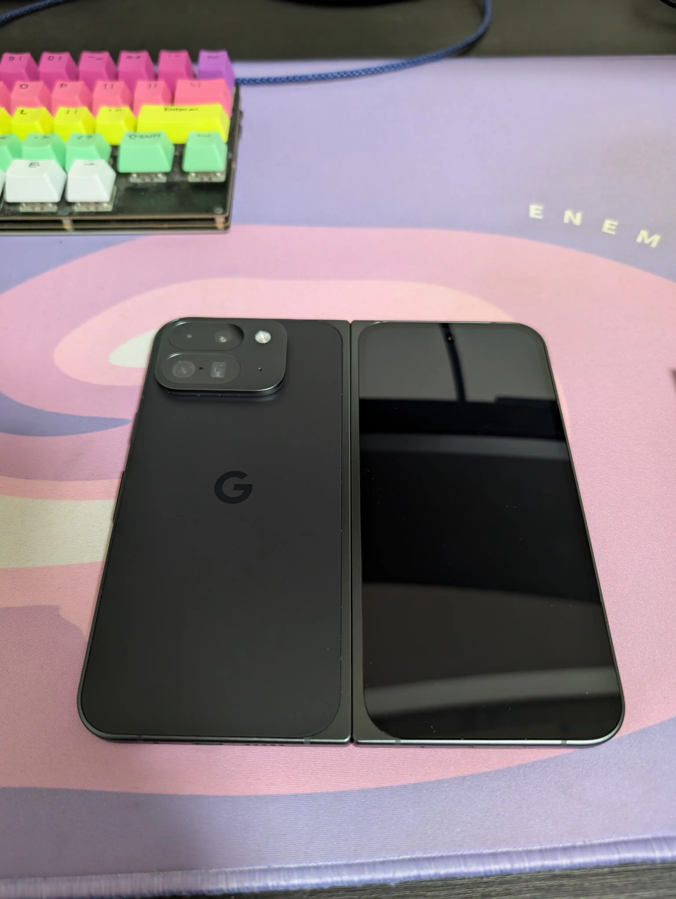

# Foldable端末で最強のメモ環境を作りたい

Kurogoma4D

<div class="abs-br m-6 flex gap-2">
  <a href="https://github.com/Kurogoma4D" target="_blank" alt="GitHub"
    class="text-xl slidev-icon-btn opacity-50 !border-none !hover:text-white">
    <carbon-logo-github />
  </a>
</div>

<!--
発表者向けのメモ: 
このプレゼンテーションでは、Foldable端末の特性を活かした最強のメモ環境についてお話しします。
-->

---
transition: fade-out
layout: center
---

# Android で最強のメモ環境を作りたい！

- 日々のメモを取るのにCosenseを使っている
- 昨今のAIブームのアオリを受けて、Cosenseからの脱却を図る

<!--
マークダウンエディタは技術者にとって使い勝手の良い記法です。
Cosenseは良いアプリですが、自分の理想とするエディタを作りたいと思います。
-->

---
transition: fade-out
---

# 今のメイン端末

<div class="flex flex-col items-center justify-center">
  <div class="text-center mb-4">
    <span class="text-2xl font-bold">Pixel 9 Pro Fold</span>
  </div>
  
  <div class="flex justify-center">
    
  </div>
  
  <div class="mt-8 text-xl">
    Foldable対応をちゃんとしたエディタを作ろう！
  </div>
</div>

<!--
Pixel 9 Pro Foldは折りたたみ式の大画面を活かせるアプリを作るのに最適なデバイスです。
-->

---
transition: fade-out
image: ./images/specs.png
layout: image-right
backgroundSize: contain
---

# やってみる

最初は仕様を.mdで書き出す

↓

コード生成

環境はVS Code Insiders + GitHub Copilot Agent

<!--
基本的な機能を説明するスライドです。
-->

---
transition: fade-out
layout: image
backgroundSize: contain
---

# ビルド結果

動画を貼る

---
transition: fade-out
layout: center
class: text-center
---

# Foldable対応

<div class="grid grid-cols-2 gap-12 mt-8">
  <div class="border-2 p-6 rounded-lg shadow-md">
    <div class="text-center font-bold text-xl mb-4">閉じた状態</div>
    <div class="bg-blue-100 p-4 rounded-lg text-gray-800">
      <div class="text-xl font-bold mb-2">1カラム構成</div>
      <div class="text-lg mt-4">スワイプでエディタ⇔プレビュー切替</div>
    </div>
  </div>
  
  <div class="border-2 p-6 rounded-lg shadow-md">
    <div class="text-center font-bold text-xl mb-4">開いた状態</div>
    <div class="bg-green-100 p-4 rounded-lg text-gray-800">
      <div class="text-xl font-bold mb-2">2カラム構成</div>
      <div class="text-lg">エディタとプレビューを並べて表示</div>
      <div class="text-lg mt-2">左右のカラムは入れ替え可能</div>
    </div>
  </div>
</div>

---
transition: fade-out
---

# どうすればいいか

```kotlin
val windowSizeClass = currentWindowAdaptiveInfo().windowSizeClass
val isOpened = windowSizeClass.isWidthAtLeastBreakpoint(WindowSizeClass.WIDTH_DP_MEDIUM_LOWER_BOUND)
```

https://developer.android.com/develop/ui/compose/layouts/adaptive?hl=ja

これを追加して、Composableを出し分ける
